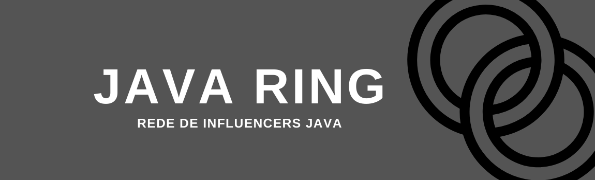
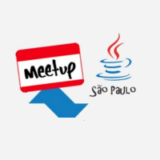

<h4 align="center">
  
Java Ring

  
Precisamos reunir a comunidade que cria conteúdo <i>Java!</i> ☕

</h4>

  <a href="#handshake-comunidade">Comunidade</a>&nbsp;&nbsp;&nbsp;|&nbsp;&nbsp;&nbsp;
  <a href="#thumbsup-como-contribuir">Como Contribuir</a>&nbsp;&nbsp;&nbsp;|&nbsp;&nbsp;&nbsp;
  <a href="#memo-licença">Licença</a>&nbsp;&nbsp;&nbsp;

<h1 align="center">
  
</h1>

## :handshake: Comunidade

<table>
  <tr>
    <td align="center">
         
        
          <b>Alberto Souza - DevEficiente</b>  
          <b>
            
         </b>
          <b>
            
         </b>
          <b>
            
         </b> 
         <b>
            
         </b>
        
    </td>
    <td align="center">
         
        
          <b>Elder Moraes</b>  
          <b>
            
         </b>
          <b>
            
         </b>
          <b>
            
         </b> 
         <b>
            
         </b>
        
    </td>
    <td align="center">
         
        
          <b>F. Boaglio - DevMultitask</b>  
          <b>
            
         </b>
          <b>
            
         </b>
          <b>
            
         </b> 
         <b>
            
         </b>
        
    </td>
    <td align="center">
         
        
          <b>Kamila Code</b>  
          <b>
            
         </b>
          <b>
            
         </b>
          <b>
            
         </b>
         <b>
            
         </b>
        
    </td>
    <td align="center">
         
        
          <b>Loiane Groner</b>  
          <b>
            
         </b>
          <b>
            
         </b>
         <b>
            
         </b>
          <b>
            
         </b>
         <b>
            
         </b>
        
    </td>
    <tr>
       <td align="center">
         
        
          <b>Maximillian Arruda</b>  
          <b>
            
         </b>
          <b>
            
         </b>
         <b>
            
         </b>
          <b>
            
         </b>
         <b>
            
         </b>
        
    </td>
    <td align="center">
         
        
          <b>Michelli Brito - Decoder Project</b>  
          <b>
            
         </b>
          <b>
            
         </b>
          <b>
            
         </b>
         <b>
            
         </b>
        
    </td>
    <td align="center">
         
        
          <b>Nélio Alves - DevSuperior</b>  
          <b>
            
         </b>
          <b>
            
         </b>
          <b>
            
         </b> 
         <b>
            
         </b>
        
    </td>
    <td align="center">
         
        
          <b>Professor Isidro</b>  
          <b>
            
         </b>
          <b>
            
         </b>
          <b>
            
         </b> 
         <b>
            
         </b>
        
    </td>
    <td align="center">
         
        
          <b>Rafael Nero - Java Challengers</b>  
          <b>
            
         </b>
          <b>
            
         </b>
          <b>
            
         </b> 
         <b>
            
         </b>
        
    </td>
</tr>
<tr>
    <td align="center">
         
        
          <b>RinaldoDev</b>  
          <b>
            
         </b>
          <b>
            
         </b>
          <b>
            
         </b> 
         <b>
            
         </b>
        
    </td>
    <td align="center">
         
        
          <b>Rodrigo Tavares - Expertos Tech</b>  
          <b>
            
         </b>
          <b>
            
         </b>
          <b>
            
         </b> 
         <b>
            
         </b>
        
    </td>
    <td align="center">
         
        
          <b>Sergio Lopes</b>  
          <b>
            
         </b>
          <b>
            
         </b>
          <b>
            
         </b> 
         <b>
            
         </b>
        
    </td>
    <td align="center">
         
        
          <b>Thomás da Costa</b>  
          <b>
            
         </b>
          <b>
            
         </b>
          <b>
            
         </b> 
         <b>
            
         </b>
        
    </td>
    <td align="center">
         
        
          <b>William Suane - DevDojo</b>  
          <b>
            
         </b>
          <b>
            
         </b>
          <b>
            
         </b> 
         <b>
            
         </b>
        
    </td>
</tr>
<tr>
    <td align="center">
         
        
          <b>Devs Java Girl BR</b>  
          <b>
            
         </b>
          <b>
            
         </b>
          <b>
            
         </b> 
         <b>
            
         </b>
        
    </td>
    <td align="center">
         
        
          <b>Java Meetup SP</b>  
          <b>
            
         </b>
          <b>
            
         </b>
          <b>
            
         </b>
          <b>
            
         </b>
         <b>
            
         </b>
        
    </td>
    <td align="center">
         
        
          <b>SouJava</b>  
          <b>
            
         </b>
          <b>
            
         </b>
          <b>
            
         </b>
          <b>
            
         </b>
         <b>
            
         </b>
        
    </td>
    <td align="center">
         
        
          <b>Igor Rudel</b>  
          <b>
            
         </b>
          <b>
            
         </b>
          <b>
            
         </b> 
         <b>
            
         </b>
        
    </td>
</tr>
</table>

## :thumbsup: Como contribuir

- Faça um fork;
- Comite suas mudanças: `git commit -m 'Adicionei +1 influencer =D'`;
- Faça um push para sua branch: `git push origin main`.

## :memo: Licença

Esse projeto está sobre a licença GPL 3.0. Para mais detalhes
veja [LICENSE](https://github.com/boaglio/java-ring/blob/main/LICENSE).

